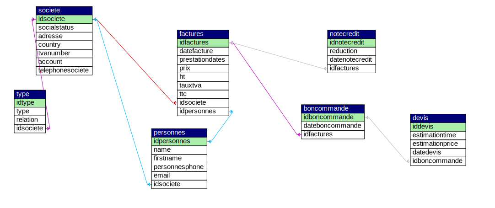

# COGIP-app

* Projet à trois du *28/08 au 04/09/2018*.  
* Lien vers [consignes](https://github.com/becodeorg/Johnson2/tree/master/projets/COGIPapp). 

--- 

## Le projet

Création d'un dashboard pour Jean-Christian Ranu, comptable à la COGIP afin de gérer les sociétés, factures et clients de la manière la plus efficace possible. 

### Objectifs d'apprentissage

* Crypter le mot de passe dans la base de données (il ne doit pas apparaître en clair)
* Utiliser la structure MVC pour ranger vos fichiers et vos fonctionnalités
* Utiliser un routeur
* Savoir mettre en place une session
* Permettre ou non l'accès à certaines pages en fonction des permissions de session

## Equipe - Team Ranu

* [Guillaume Deruwez](https://github.com/gderuwez)
* [Nicolas de Liedekerke](https://github.com/Liedekerke)
* [Charlotte Tusset](https://github.com/CharlotteTusset)

## Tâches

* Scrum master: Guillaume
* Structure MVC: initié par Guillaume
* PHP my admin: initié par Guillaume
* Tableaux et update/delete/add:
	* Factures: Guillaume
	* Sociétés: Charlotte
	* Contacts: Nicolas
* Création sessions: en groupe
* Front-end: Charlotte
* Readme: Charlotte

## Schéma DB

  

## SQL 

Ajouter! 
